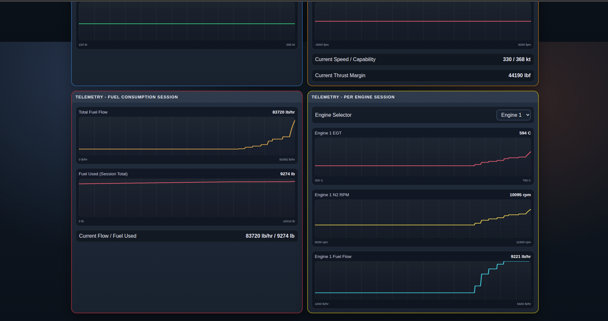
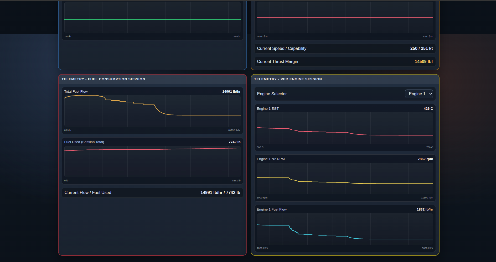
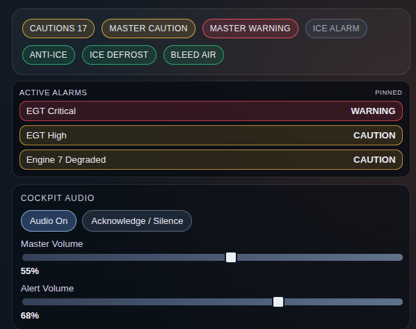
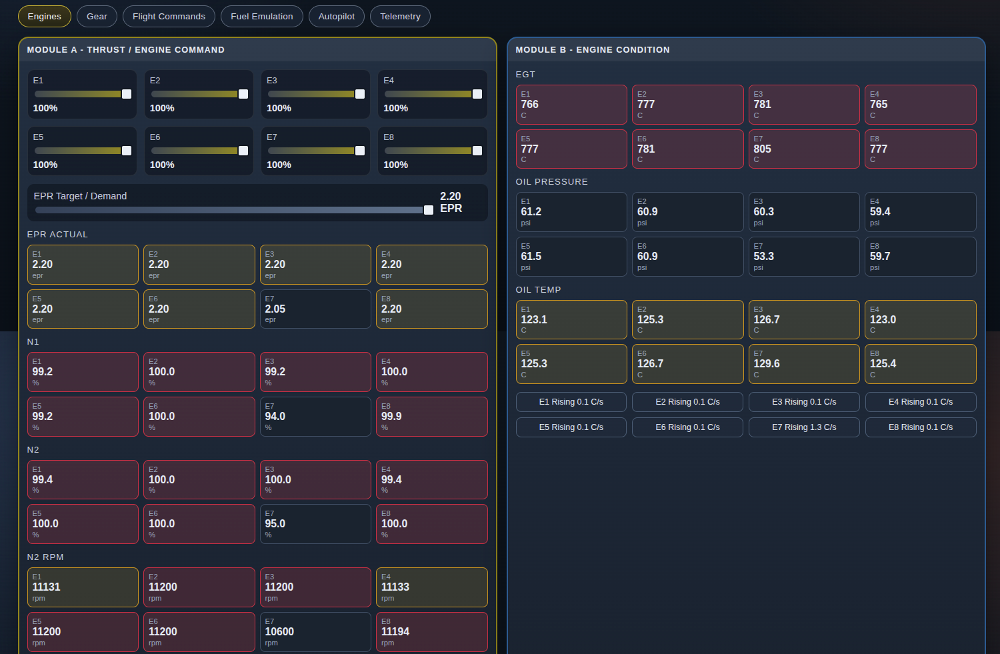

# EngineSyncConsole
Multi-Engine Console is a React-based central avionics simulation console for engine controls, flight navigation, alarm management, and cabin activity monitoring. It enables users to analyze aircraft behavior, trigger and test sound alarms, and simulate engine and onboard system responses in a controlled environment.

EngineSyncConsole is a browser-based avionics/systems console inspired by TF33-class multi-engine aircraft behavior. It is designed for visualization, training logic, and systems interaction rather than exact certified engine replication.

## Features

### Engine and Performance
- 8-engine simulation model with independent throttle controls (E1-E8).
- Target EPR command plus per-engine EPR actual monitoring.
- Live engine metrics: RPM, EGT, oil pressure, oil temperature, and trend rate.
- Engine fault injection on a selected engine (degraded performance behavior).
- Throttle symmetry tracking and separate wing-tank fuel imbalance monitoring.

### Fuel, Weight, and Range
- Fuel model with aircraft-style tanks: FWD, AFT, LEFT WING, RIGHT WING.
- Fuel transfer mode and crossfeed equalization behavior.
- Boost pump and transfer state controls.
- Per-engine and total fuel flow monitoring.
- Adjustable payload selector for mission/load simulation.
- Fuel endurance and predicted range estimation.
- Trip timer, distance (nm), and fuel used since startup.

### Flight Systems and AFCS
- Flight systems status: hydraulic pressure, electrical bus A/B, and generator online states.
- AFCS/autopilot panel with AFCS master engage/standby.
- AFCS modes: altitude hold, heading hold, nav coupled, and speed hold.
- AFCS selectors for target altitude, heading, airspeed, and vertical speed.
- Autothrottle behavior when speed hold is active.
- Manual throttle override window to temporarily bypass autothrottle.

### Gear and Safety
- Gear simulation with transit delay, lock indications (nose/left/right), and unsafe detection.
- Master caution/warning logic and caution count aggregation.
- Annunciators for key conditions (EGT high/critical, low oil pressure, fuel imbalance, throttle asymmetry, electrical bus low, ice alarm, gear unsafe, engine degraded).

### Audio and Alerts
- Cockpit audio on/off control.
- Cockpit master volume and alert volume controls.
- UI switch click sounds.
- Ambient engine loop audio tied to engine power.
- Warning/caution tones with priority loop behavior.
- Dedicated ice alert and gear warning callouts.
- Acknowledge/silence alerts control.

### Telemetry and UI
- Telemetry tab with live trend chart for airspeed.
- Telemetry tab with live trend chart for throttle speed capability.
- Telemetry tab with live trend chart for full-throttle speed capability.
- Telemetry tab with live trend chart for thrust margin.
- Telemetry tab with live trend chart for altitude.
- Telemetry tab with live trend chart for vertical speed.
- Built with React + Vite and organized in modular tabs: Engines, Gear, Flight Commands, Fuel Emulation, Autopilot, Telemetry.

## Engine Model Basis

The simulation is based on the **Pratt & Whitney TF33 / JT3D family** (classic low-bypass turbofan behavior), adapted for an 8-engine long-range aircraft console model.

### Reference Configuration
- Engine type: low-bypass turbofan.
- Reference thrust: ~`17,000 lbf` per engine (max).
- Reference airflow: ~`450 lb/sec` per engine.
- Bypass ratio basis: ~`1.4`.

### Spool and RPM Bands
- `N1` (low-pressure spool): idle ~`30-35%`, cruise ~`70-85%`, high power/takeoff ~`95-100%`.
- `N2` (high-pressure spool): idle ~`60%`, cruise ~`85-95%`, high power/takeoff ~`100%`.
- RPM basis: `N1` ~`8,000-9,000 rpm`, `N2` ~`10,000-11,500 rpm`.

### Fuel and Temperature Basis

### Fuel Flow and EGT Bands
- TSFC basis: ~`0.74-0.78 lb/(lbf*hr)` (modeled around `0.76`).
- Fuel flow per engine: cruise ~`3,000-5,000 lb/hr`, max power up to ~`12,000+ lb/hr`.
- Fuel flow (8 engines total): cruise ~`25,000-40,000 lb/hr`, high power ~`96,000-104,000 lb/hr`.
- EGT basis: idle ~`300-400 C`, cruise ~`500-650 C`, high power limit ~`700-800 C`.

### Dynamics and Realism Assumptions

- Legacy turbofan spool response is intentionally **slower** than modern engines (inertia/lag).
- Fuel burn increases non-linearly with high spool/thrust demand.
- Thrust/fuel/temperature are coupled with legacy-engine style trends for training visualization.

## Alert and Control Logic

### Warning and Caution Triggers
- `MASTER WARNING`: any engine EGT above `760 C`.
- `MASTER CAUTION`: one or more caution conditions present.
- `EGT HIGH`: any engine EGT above `700 C`.
- `LOW OIL PRESS`: any engine oil pressure below `35 psi`.
- `FUEL IMBALANCE`: left/right wing tank mass imbalance above `2.2%` of total fuel capacity.
- `THROTTLE ASYMMETRY`: left/right throttle bank symmetry delta above `2.2%`.
- `ELEC BUS LOW`: electrical bus A or B below `25 V`.
- `AIRFRAME ICE`: anti-ice/defrost is off.
- `ENGINE DEGRADED`: fault injection enabled for the selected engine.
- `GEAR UNSAFE`: gear lever is down, gear is not locked, and gear is not in transit.

### Supporting Behaviors
- Gear transit updates lock state after a short transition delay.
- `Ice Defrost`/anti-ice can be toggled on or off; when off, airframe ice caution remains active.
- EGT escalates from caution (`>700 C`) to warning (`>760 C`).
- Per-engine oil temperature trend is shown in `C/s`; abnormal trend (`|trend| > 7`) contributes to caution count.

## Autopilot and Engine Power

### AFCS Control Modes
- Toggleable controls: `AFCS master`, `Altitude hold`, `Heading hold`, `Nav coupled`, `Speed hold`.
- AFCS target selectors: altitude (ft), heading (deg), airspeed (kt), vertical command (fpm).

### Autothrottle Behavior
- Active only when `AFCS master` is on and `Speed Hold` is enabled.
- Uses current airspeed error vs target airspeed to adjust all throttles.
- Includes smoothing/integrator behavior to avoid abrupt throttle jumps.
- Manual throttle movement temporarily overrides autothrottle for `5 seconds`, then auto-control resumes.

## Cockpit Sound Model

### Source Assets
- Engine ambience uses cockpit-style audio assets.
- Inside character asset: `/public/sounds/engine/engn1_inn.wav`.
- Outside character asset: `/public/sounds/engine/engn1_out.wav`.

### Mixing and Dynamics
- Audio loudness is driven by active engine count (`>8%` throttle) and weighted average power.
- As active engine count and power increase, ambience becomes stronger.
- As power decreases or engines fall below active threshold, ambience softens.
- Playback rate scales with average power for intensity.
- Ambient transitions are smoothed to avoid clicks/pops during throttle changes.

## Screenshots

### Core Console Views
- Main overview.

- Engines tab.

- Gear tab.

- Flight Commands tab.

- Fuel Emulation tab.

- Autopilot tab.


### Telemetry Views
- Telemetry tab.

- Telemetry fuel session.

- Telemetry fuel session (low burn).


## Alarm Cases

Alarm cases look like this when warnings/cautions are active:




## Run

### Development
```bash
npm install
npm run dev
```

## Build

### Production Preview
```bash
npm run build
npm run preview
```
