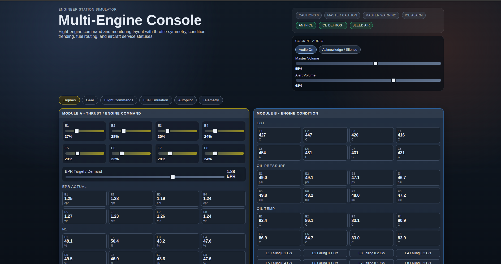
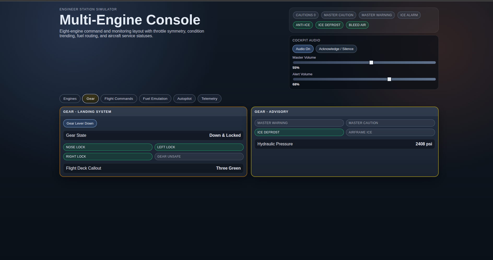
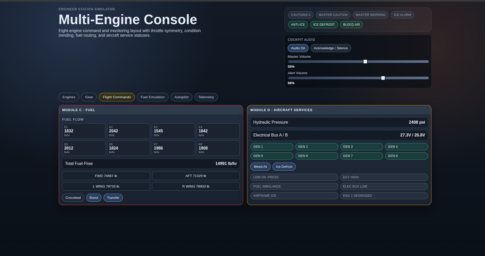
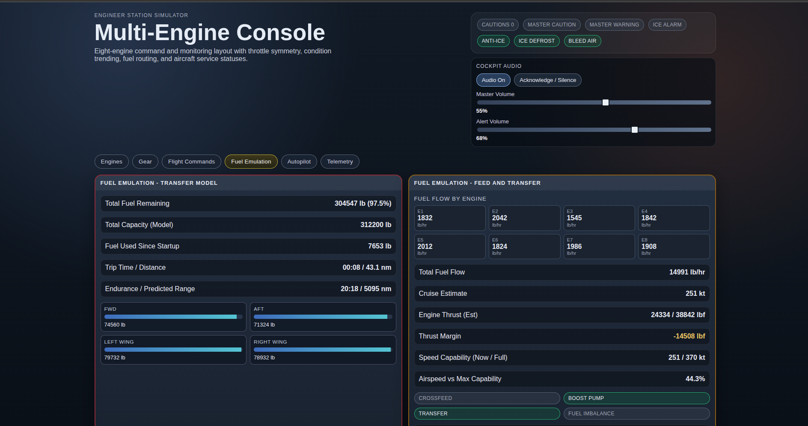
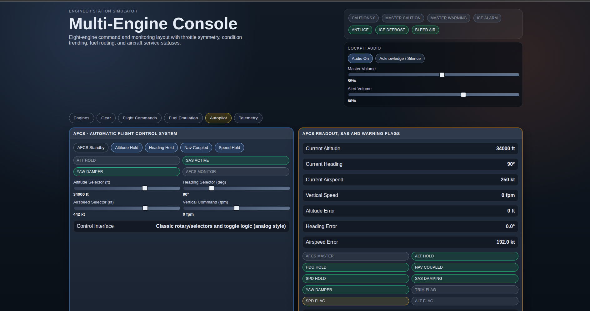
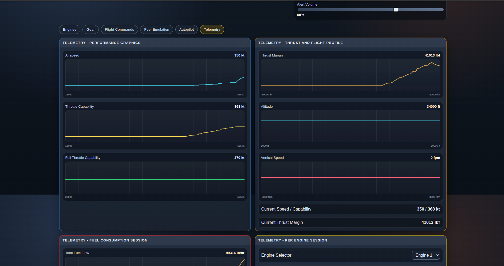

# EngineSyncConsole
Multi-Engine Console is a React-based central avionics simulation console for engine controls, flight navigation, alarm management, and cabin activity monitoring. It enables users to analyze aircraft behavior, trigger and test sound alarms, and simulate engine and onboard system responses in a controlled environment.

## Features

- 8-engine simulation model with independent throttle controls (E1-E8).
- Target EPR command plus per-engine EPR actual monitoring.
- Live engine metrics: RPM, EGT, oil pressure, oil temperature, and trend rate.
- Throttle symmetry and left/right imbalance tracking.
- Engine fault injection on a selected engine (degraded performance behavior).
- Fuel model with aircraft-style tanks: FWD, AFT, LEFT WING, RIGHT WING.
- Fuel transfer mode and crossfeed equalization behavior.
- Boost pump and transfer state controls.
- Per-engine and total fuel flow monitoring.
- Fuel endurance and predicted range estimation.
- Trip timer, distance (nm), and fuel used since startup.
- Flight systems status: hydraulic pressure, electrical bus A/B, and generator online states.
- AFCS/autopilot panel with AFCS master engage/standby.
- AFCS modes: altitude hold, heading hold, nav coupled, and speed hold.
- AFCS selectors for target altitude, heading, airspeed, and vertical speed.
- Autothrottle behavior when speed hold is active.
- Manual throttle override window to temporarily bypass autothrottle.
- Gear simulation with transit delay, lock indications (nose/left/right), and unsafe detection.
- Master caution/warning logic and caution count aggregation.
- Annunciators for key conditions (EGT high/critical, low oil pressure, fuel imbalance, electrical bus low, ice alarm, gear unsafe, engine degraded).
- Cockpit audio on/off control.
- Cockpit master volume and alert volume controls.
- UI switch click sounds.
- Ambient engine loop audio tied to engine power.
- Warning/caution tones with priority loop behavior.
- Dedicated ice alert and gear warning callouts.
- Acknowledge/silence alerts control.
- Telemetry tab with live trend chart for airspeed.
- Telemetry tab with live trend chart for throttle speed capability.
- Telemetry tab with live trend chart for full-throttle speed capability.
- Telemetry tab with live trend chart for thrust margin.
- Telemetry tab with live trend chart for altitude.
- Telemetry tab with live trend chart for vertical speed.
- Built with React + Vite and organized in modular tabs: Engines, Gear, Flight Commands, Fuel Emulation, Autopilot, Telemetry.

## Alert and Control Logic

- `MASTER WARNING` trigger: any engine EGT above `680 C`.
- `MASTER CAUTION` trigger: active when one or more caution conditions are present.
- `EGT HIGH` caution: any engine EGT above `650 C`.
- `LOW OIL PRESS` caution: any engine oil pressure below `35 psi`.
- `FUEL IMBALANCE` caution: left/right throttle symmetry delta above `2.2%`.
- `ELEC BUS LOW` caution: electrical bus A or B below `25 V`.
- `AIRFRAME ICE` caution: anti-ice/defrost is off.
- `ENGINE DEGRADED` caution: fault injection is enabled for the selected engine.
- `GEAR UNSAFE` caution: gear lever is down, gear is not locked, and gear is not in transit.
- Gear transit behavior: when gear is toggled, lock state updates after a short transition delay.
- Defrost behavior: `Ice Defrost`/anti-ice can be toggled on or off; when off, airframe ice caution remains active.
- Overpower/over-temp behavior: high EGT values move from caution (`>650 C`) to warning (`>680 C`).
- Oil trend behavior: per-engine temperature trend is shown in `C/s`; abnormal trend magnitude (`|trend| > 7`) contributes to caution count.

## Autopilot and Engine Power

- AFCS controls are fully toggleable (`on/off`) for:
  - AFCS master
  - Altitude hold
  - Heading hold
  - Nav coupled
  - Speed hold
- AFCS target selectors:
  - Altitude target (ft)
  - Heading target (deg)
  - Airspeed target (kt)
  - Vertical command (fpm)
- Engine power auto-control (autothrottle):
  - Active only when `AFCS master` is on and `Speed Hold` is enabled.
  - Uses current airspeed error vs target airspeed to adjust all throttles.
  - Includes smoothing/integrator behavior to avoid abrupt throttle jumps.
  - Manual throttle movement temporarily overrides autothrottle for `5 seconds`, then auto-control resumes.

## Cockpit Sound Model

- Engine ambience uses original cockpit-style engine audio assets from:
  - `/public/sounds/engine/engn1_inn.wav` (inside character)
  - `/public/sounds/engine/engn1_out.wav` (outside character)
- Audio loudness is dynamically driven by:
  - Number of active engines (an engine is treated as active above `8%` throttle).
  - Overall engine power level (weighted average throttle).
- As more engines are active and power increases, cockpit ambience becomes stronger.
- As engines reduce power or drop below active threshold, ambience softens accordingly.
- Playback rate is also adjusted with average power, so higher power sounds more intense.
- Ambient transitions are smoothed to avoid abrupt clicks/pops while moving throttles.

## Screenshots

### Main Overview



### Engines


### Gear



### Flight Commands



### Fuel Emulation



### Autopilot



### Telemetry



## Run

```bash
npm install
npm run dev
```

## Build

```bash
npm run build
npm run preview
```
